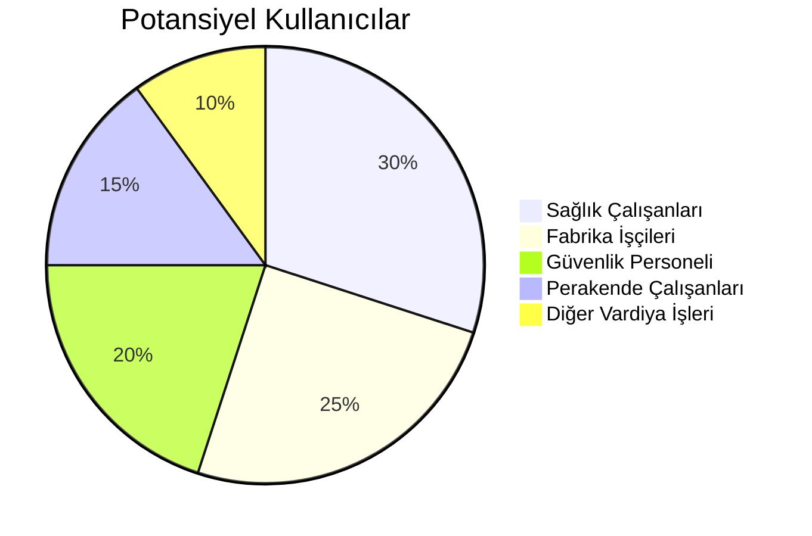

# 📊 Vardiya Takvim Oluşturucusu - Proje Analizi ve Yol Haritası

> **Analiz Tarihi:** 22 Aralık 2024  
> **Proje Durumu:** MVP (Minimum Viable Product) Tamamlanmış  
> **Potansiyel:** Ticari Ürün / SaaS

---

## 📋 İçindekiler

1. [Mevcut Durum Analizi](#mevcut-durum-analizi)
2. [Teknik Altyapı](#teknik-altyapı)
3. [Güçlü Yanlar](#güçlü-yanlar)
4. [Zayıf Yanlar ve Eksikler](#zayıf-yanlar-ve-eksikler)
5. [Ticarileştirme Fırsatları](#ticarileştirme-fırsatları)
6. [Geliştirme Yol Haritası](#geliştirme-yol-haritası)
7. [Rakip Analizi](#rakip-analizi)
8. [Önerilen Teknoloji Geçişleri](#önerilen-teknoloji-geçişleri)

---

## Mevcut Durum Analizi

### Proje Özeti

Vardiya çalışanlarının programlarını OCR veya manuel giriş ile takvim formatına (ICS) dönüştüren ve Google Gemini AI ile aktivite planlaması yapan bir web uygulaması.

### Temel Özellikler

| Özellik                | Durum    | Açıklama                       |
| ---------------------- | -------- | ------------------------------ |
| OCR ile Görsel Tarama  | ✅ Aktif | Tesseract OCR entegrasyonu     |
| Manuel Metin Girişi    | ✅ Aktif | Türkçe gün formatları destekli |
| ICS Dosya Üretimi      | ✅ Aktif | Floating time formatı          |
| AI Aktivite Planlaması | ✅ Aktif | Gemini 2.0 Flash entegrasyonu  |
| Uyku Saati Otomasyonu  | ✅ Aktif | Vardiya sonrası 8 saat uyku    |
| Enerji Yönetimi        | ✅ Aktif | Yüksek/Düşük enerji slotları   |
| Web Arayüzü            | ✅ Aktif | FastAPI + Jinja2 Templates     |
| Docker Desteği         | ✅ Aktif | Dockerfile mevcut              |

### Akış Diyagramı


---

## Teknik Altyapı

### Backend Stack

- **Framework:** FastAPI 0.104+
- **Template Engine:** Jinja2
- **AI:** Google Gemini 2.0 Flash
- **OCR:** Tesseract (pytesseract)
- **Image Processing:** Pillow
- **Timezone:** pytz (Europe/Istanbul)

### Proje Yapısı

```
vardiya-takvim-oluturucusu/
├── main.py                 # Ana FastAPI uygulaması (661 satır)
├── services/
│   ├── ai_planner.py       # AI planlama servisi
│   ├── ics_generator.py    # ICS dosya üretici
│   ├── shift_parser.py     # Vardiya parser
│   └── timeline_builder.py # Timeline oluşturucu
├── static/                 # CSS, JS, görseller
├── templates/              # HTML şablonları
├── Dockerfile              # Docker konfigürasyonu
└── requirements.txt        # Python bağımlılıkları
```

### API Endpoints

| Endpoint              | Method | Açıklama                   |
| --------------------- | ------ | -------------------------- |
| `/`                   | GET    | Ana sayfa                  |
| `/generate-plan`      | POST   | AI destekli plan oluşturma |
| `/download-plan/{id}` | GET    | ICS indirme                |
| `/health`             | GET    | Health check               |

---

## Güçlü Yanlar

1. **Akıllı Uyku Yönetimi**
   - Vardiya bitiş saatine göre dinamik uyku planlaması
   - Gece vardiyası sonrası özel mantık
2. **Insomnia Filtresi**
   - Gece 00:00-07:00 arası aktivite engellemesi
   - İnsan biyoritmine uygun planlama
3. **Enerji Bazlı Planlama**
   - Yüksek/Düşük enerji slotları
   - Aktivite türüne göre slot eşleştirme
4. **Türkçe Dil Desteği**
   - Tüm gün kısaltmaları (Pzt, Sal, Çar...)
   - İzin/Tatil anahtar kelimeleri
5. **Cross-Platform Uyumluluk**
   - Windows + Linux (Docker) Tesseract desteği

---

## Zayıf Yanlar ve Eksikler

### Kritik Eksikler

| Eksik                          | Öncelik   | Etki                     |
| ------------------------------ | --------- | ------------------------ |
| Kullanıcı Hesapları            | 🔴 Yüksek | Kişisel veri saklayamama |
| Veritabanı                     | 🔴 Yüksek | Geçmiş plan kaybı        |
| Çoklu Hafta Desteği            | 🟡 Orta   | Uzun vadeli planlama yok |
| Mobil Uygulama                 | 🟡 Orta   | Erişilebilirlik          |
| Google/Apple Takvim Sync       | 🟡 Orta   | Manuel indirme gerekli   |
| Tekrarlayan Vardiya Şablonları | 🟢 Düşük  | Kolaylık                 |

### Teknik Borç

1. **Monolitik main.py**
   - 661 satırlık tek dosya
   - Services klasörü kullanılmıyor gibi görünüyor
2. **Hata Yönetimi**
   - Gemini API timeout'u 30 saniye
   - Detaylı hata mesajları eksik
3. **Test Eksikliği**
   - Unit test yok
   - Integration test yok
4. **Güvenlik**
   - API rate limiting yok
   - Input validation minimal

---

## Ticarileştirme Fırsatları

### Hedef Kitle



### SaaS Model Önerisi

| Plan         | Fiyat  | Özellikler                            |
| ------------ | ------ | ------------------------------------- |
| **Ücretsiz** | ₺0     | Haftalık 2 plan, reklam destekli      |
| **Pro**      | ₺29/ay | Sınırsız plan, takvim sync, şablonlar |
| **Takım**    | ₺99/ay | 10 kullanıcı, paylaşım, raporlar      |
| **Kurumsal** | Teklif | API erişimi, özel entegrasyonlar      |

### Gelir Kaynakları

1. **Abonelik Modeli** - Aylık/Yıllık Pro üyelik
2. **API Erişimi** - B2B entegrasyonlar
3. **White-Label** - Hastane/fabrika özel versiyonları
4. **Reklam** - Ücretsiz kullanıcılar için

---

## Geliştirme Yol Haritası

### Faz 1: Stabilizasyon (1-2 Hafta)

- [ ] Unit test altyapısı kurulumu
- [ ] main.py modülerleştirme (services kullanımı)
- [ ] Hata yönetimi iyileştirmesi
- [ ] Logging sistemi

### Faz 2: Kullanıcı Sistemi (2-3 Hafta)

- [ ] Veritabanı entegrasyonu (PostgreSQL/SQLite)
- [ ] Kullanıcı kaydı ve girişi
- [ ] Plan geçmişi saklama
- [ ] Kişisel ayarlar

### Faz 3: Gelişmiş Özellikler (3-4 Hafta)

- [ ] Çoklu hafta desteği
- [ ] Vardiya şablonları
- [ ] Google Calendar API entegrasyonu
- [ ] Apple Calendar entegrasyonu
- [ ] Push bildirimleri

### Faz 4: Mobil & Genişleme (4-6 Hafta)

- [ ] Progressive Web App (PWA)
- [ ] React Native mobil uygulama
- [ ] Çoklu dil desteği
- [ ] Takım özellikleri

### Faz 5: Monetizasyon (2-4 Hafta)

- [ ] Stripe ödeme entegrasyonu
- [ ] Abonelik yönetimi
- [ ] Admin paneli
- [ ] Analytics dashboard

---

## Rakip Analizi

| Rakip            | Güçlü Yanları        | Zayıf Yanları    | Bizim Avantajımız |
| ---------------- | -------------------- | ---------------- | ----------------- |
| **Shiftboard**   | Kurumsal, kapsamlı   | Pahalı, karmaşık | Basitlik, Türkçe  |
| **When I Work**  | Mobil, ekip yönetimi | B2B odaklı       | Bireysel odak     |
| **Humanity**     | AI planlama          | İngilizce        | Türkçe AI, yerel  |
| **Excel/Manual** | Ücretsiz             | Zaman alıcı      | Otomasyon         |

### Rekabet Avantajları

1. **Türkçe AI Entegrasyonu** - Yerel dil desteği
2. **OCR Özelliği** - Fotoğraftan vardiya çıkarma
3. **Enerji Bazlı Planlama** - Benzersiz özellik
4. **Insomnia Filtresi** - Sağlık odaklı yaklaşım

---

## Önerilen Teknoloji Geçişleri

### Kısa Vadeli (Mevcut Stack İyileştirme)

```diff
- main.py monoliti
+ Modüler servis mimarisi

- Session-based state
+ Redis cache

- Manuel OCR
+ Cloud Vision API (daha doğru)
```

### Orta Vadeli (Ölçeklendirme)

| Mevcut        | Önerilen       | Gerekçe           |
| ------------- | -------------- | ----------------- |
| SQLite        | PostgreSQL     | Ölçeklenebilirlik |
| Jinja2        | React/Next.js  | Modern UI/UX      |
| Manuel deploy | CI/CD Pipeline | Otomasyon         |

### Uzun Vadeli (Kurumsal Hazırlık)

- Kubernetes deployment
- Microservices mimarisi
- GraphQL API
- Real-time sync (WebSockets)

---

## Başarı Metrikleri

### Teknik KPI'lar

- API yanıt süresi < 2 saniye
- Uptime > 99.5%
- OCR doğruluk oranı > 90%

### İş KPI'ları

- Aylık aktif kullanıcı (MAU)
- Dönüşüm oranı (Ücretsiz → Pro)
- Müşteri memnuniyeti (NPS)
- Churn rate

---

## Sonuç ve Öneri

Bu proje, **niş bir pazarda gerçek bir sorunu çözen** değerli bir MVP'dir. Ticarileşme potansiyeli yüksektir ancak aşağıdaki adımlar kritiktir:

> [!IMPORTANT] **Öncelikli 3 Adım:**
>
> 1. Kullanıcı hesap sistemi eklenmesi
> 2. Veritabanı entegrasyonu
> 3. Google Calendar sync

Türkiye'de vardiya çalışanlarının büyük çoğunluğu hâlâ manuel yöntemler kullandığından, doğru pazarlama ile hızlı büyüme potansiyeli mevcuttur.

---

_Bu analiz, kod incelemesi ve mevcut proje yapısı baz alınarak hazırlanmıştır._
